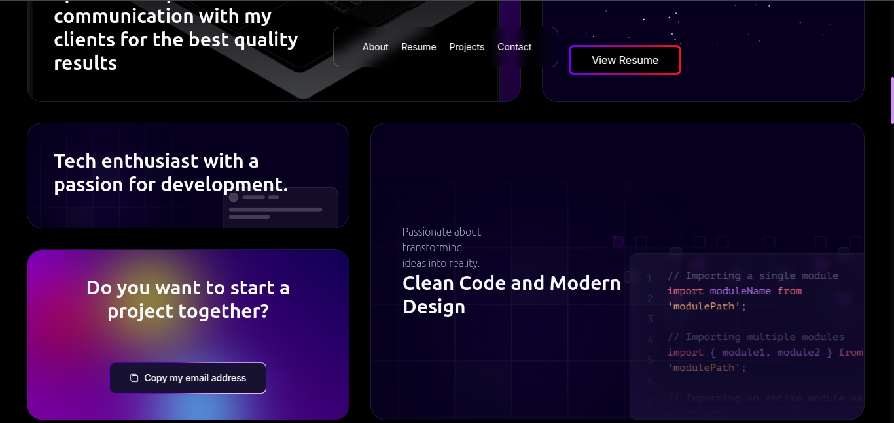

# 📋 Table of Contents
1. 🤖 Introduction
2. ⚙️ Tech Stack
3. 🔋 Features
4. 🤸 Quick Start

# 🤖 Introduction
Built with Next.js for handling the user interface, Three.js for rendering 3D elements, Framer motion for beautiful animations, and styled with TailwindCSS, this portfolio demonstrates the developer's skills in a unique manner that creates a lasting impact.

# ⚙️ Tech Stack
- Next.js
- Three.js
- Framer Motion
- Tailwind CSS

# 🔋 Features
➡ **Hero**: Captivating introduction featuring a spotlight effect and dynamic background.

➡ **Bento Grid**: Modern layout presenting personal information using cutting-edge CSS design techniques.

➡ **3D Elements**: Interactive 3D design elements, such as a GitHub-style globe and card hover effects, adding depth and engagement.

➡ **Testimonials**: Dynamic testimonials area with scrolling or animated content for enhanced engagement.

➡ **Work Experience**: Prominent display of professional background for emphasis and credibility.

➡ **Canvas Effect**: Innovative use of HTML5 canvas to create visually striking effects in the "approaches" section.

➡ **Responsiveness**: Seamless adaptability across all devices, ensuring optimal viewing experience for every user and many more, including code architecture and reusability

# 🤸 Quick Start
Follow these steps to set up the project locally on your machine.

**Prerequisites**

Make sure you have the following installed on your machine:

- [Git](https://git-scm.com/)
- [Node.js](https://nodejs.org/en)
- [npm](https://www.npmjs.com/) (Node Package Manager)

**Cloning the Repository**
```
git clone https://github.com/AkashJana18/portfolio.git
cd portfolio
```
**Installation**

Install the project dependencies using npm:
```
npm install
```
**Running the Project**
```
npm run dev
```
Open [http://localhost:3000](http://localhost:3000) in your browser to view the project.
This is a [Next.js](https://nextjs.org/) project bootstrapped with [`create-next-app`](https://github.com/vercel/next.js/tree/canary/packages/create-next-app).

## Getting Started

First, run the development server:

```bash
npm run dev
# or
yarn dev
# or
pnpm dev
# or
bun dev
```

Open [http://localhost:3000](http://localhost:3000) with your browser to see the result.

You can start editing the page by modifying `app/page.tsx`. The page auto-updates as you edit the file.

This project uses [`next/font`](https://nextjs.org/docs/basic-features/font-optimization) to automatically optimize and load Inter, a custom Google Font.

## Learn More

To learn more about Next.js, take a look at the following resources:

- [Next.js Documentation](https://nextjs.org/docs) - learn about Next.js features and API.
- [Learn Next.js](https://nextjs.org/learn) - an interactive Next.js tutorial.

You can check out [the Next.js GitHub repository](https://github.com/vercel/next.js/) - your feedback and contributions are welcome!

## Deploy on Vercel

The easiest way to deploy your Next.js app is to use the [Vercel Platform](https://vercel.com/new?utm_medium=default-template&filter=next.js&utm_source=create-next-app&utm_campaign=create-next-app-readme) from the creators of Next.js.

Check out our [Next.js deployment documentation](https://nextjs.org/docs/deployment) for more details.
# portfolio-kaleem
